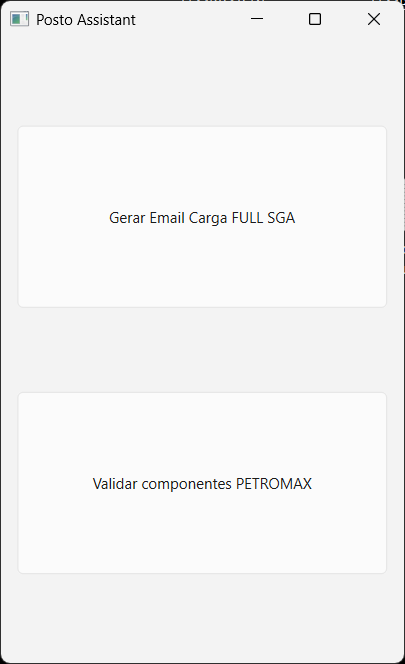
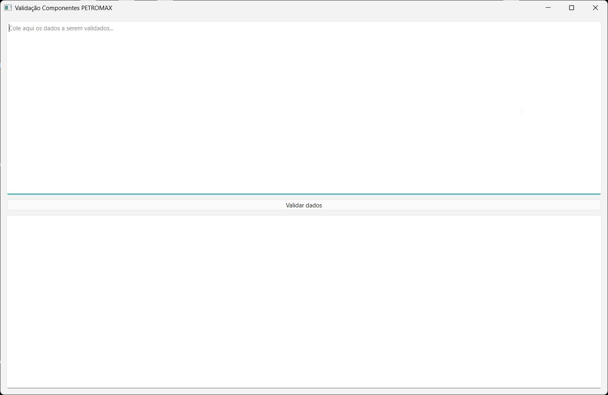
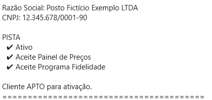
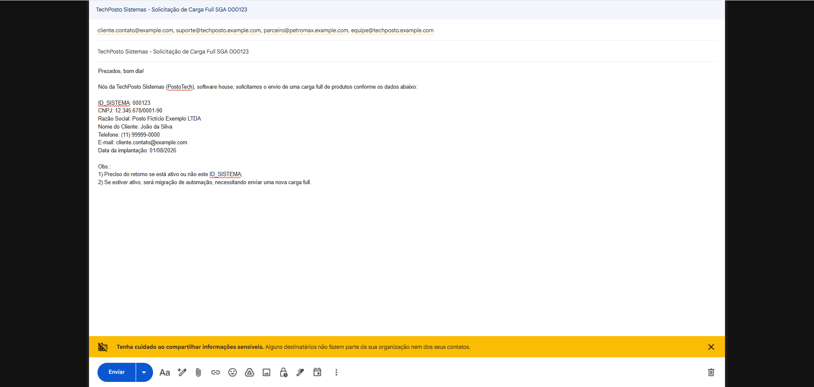

# Posto Assistant

App desktop em Python + PySide6 pra automatizar umas rotinas chatas de suporte técnico em ambientes de automação comercial (pensando em postos de combustível e redes de varejo, mas dá pra adaptar). A ideia é simples: em vez de ficar copiando e colando dado de chamado e conferindo API na mão, o app faz isso por você em alguns cliques.

> Projeto de portfólio: nomes de empresa, cliente, parceiro, e-mails, CNPJs e credenciais do projeto original foram trocados por dados fictícios. Quem quiser saber o que foi mudado e por quê, os detalhes estão guardados à parte (não vão neste repositório).

## Prints

<!-- Cole os prints do app aqui, tipo: -->






## O que ele faz

**Validação de componentes de automação** — cola o texto de um chamado (ou vários, um atrás do outro) e o app puxa CNPJ, razão social e os componentes pedidos (pista, loja, troca de óleo), bate numa API externa do parceiro e mostra se cada um tá ativo e com os aceites certos. No final já diz se o cliente está apto pra ativação ou não.

**Geração de e-mail de Carga Full** — mesma lógica: cola o texto do chamado, o app separa os campos (ID do sistema, CNPJ, razão social, nome do cliente, telefone, e-mail, data de implantação), confere se falta algo e, se estiver tudo certo, já abre um rascunho pronto no Gmail direto do navegador.

**Interface simples** — uma janelinha com dois botões, sem precisar abrir terminal pra usar no dia a dia.

## Tecnologias

- Python 3
- [PySide6](https://doc.qt.io/qtforpython/) pra interface gráfica
- [Requests](https://docs.python-requests.org/) pra falar com a API externa (OAuth2 client credentials)
- [PyInstaller](https://pyinstaller.org/) pra gerar o `.exe` no Windows
- Regex (`re`) pra extrair os dados do texto colado

## Estrutura

```
posto-assistant/
├── main.py                        # Entrada do app, janela principal
├── modules/
│   ├── ativacao/                  # Validação de componentes via API do parceiro
│   │   ├── api.py                 # Cliente HTTP (OAuth2 client credentials)
│   │   ├── janela.py              # Tela de validação
│   │   ├── parser.py              # Extrai CNPJ, razão social e componentes do texto
│   │   ├── service.py             # Junta parser + API + validator
│   │   └── validator.py           # Regras de ativação
│   ├── carga_full/
│   │   └── janela.py              # Tela de geração de e-mail
│   └── utils/
│       └── janela.py              # Centralizar janela na tela
├── services/
│   ├── parser.py                  # Extrai os campos do chamado (regex)
│   ├── email_generator.py         # Monta assunto/corpo a partir do template
│   └── gmail.py                   # Abre o rascunho no Gmail
├── templates/
│   └── carga_full_sga.txt         # Template do e-mail
├── ui/
│   └── janela_principal.py        # Reservado pra evolução futura da interface
├── mock_api/
│   └── server.py                  # Mock local da API do parceiro, só pra demonstração
├── config.py                      # Config de demonstração (aponta pro mock local)
├── requirements.txt
├── PostoAssistant.spec            # Config do PyInstaller
└── run.bat                        # Atalho pra rodar no Windows
```

## Rodando o projeto

Precisa de Python 3.10+ e pip.

```bash
git clone https://github.com/ognovais/posto-assistant.git
cd posto-assistant

python -m venv .venv
# Windows:
.venv\Scripts\activate
# Linux/macOS:
source .venv/bin/activate

pip install -r requirements.txt
python main.py
```

No Windows dá pra usar o `run.bat` também, que já ativa o venv e roda o app.

### Gerando o .exe (opcional)

```bash
pip install pyinstaller
pyinstaller PostoAssistant.spec
```

Sai em `dist/PostoAssistant.exe`.

## Testando com dados fake (mock local)

A tela de validação depende de uma API externa. Pra testar sem precisar de uma API de verdade, tem um mock bem simples em `mock_api/server.py` (só biblioteca padrão do Python, não precisa instalar nada extra). O `config.py` já vem apontando pra ele.

```bash
# Terminal 1 — sobe o mock em http://127.0.0.1:5000
python mock_api/server.py

# Terminal 2 — com o venv ativado
python main.py
```

Textos pra colar em cada tela e testar:

**Validar componentes:**
```
Posto Fictício Exemplo LTDA
12.345.678/0001-90
Pista Loja OilFast
```

**Gerar e-mail Carga Full:**
```
ID_SISTEMA: 000123
CNPJ: 12.345.678/0001-90
Razão Social: Posto Fictício Exemplo LTDA
Nome do Cliente: João da Silva
Telefone: (11) 99999-0000
E-mail: cliente.contato@example.com
Data da implantação: 01/08/2026
```

## Licença

MIT. Veja [`LICENSE`](./LICENSE).
